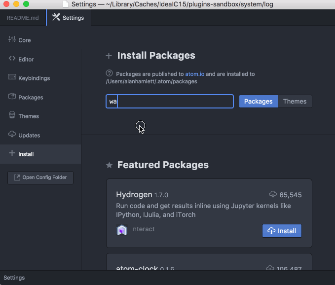

# atom-wakatime

Quantify your coding inside GitHub's Atom editor.

## Installation

1. Inside Atom, navigate to `Preferences`/`Settings` → `Install` and search for `wakatime`.

  

2. Click the `Install` button.

  

3. Click `Settings`, then enter your [api key](https://wakatime.com/settings#apikey).

4. Use Atom and your coding activity will be displayed on your [WakaTime dashboard](https://wakatime.com).

Note: The leet way to install WakaTime is with this Terminal command:

    apm install wakatime

## Screen Shots

## Configuring

Settings for atom-wakatime are under `Settings → Packages → wakatime → Settings`.

Additional settings are in `$HOME/.wakatime.cfg` for [wakatime cli](https://github.com/wakatime/wakatime#configuring).

## Troubleshooting

Atom writes errors to the Atom Developer Console. To check for errors:

1. Turn on the debug checkbox in `Settings → Packages → wakatime → Settings`
2. Inside Atom, go to `View → Developer → Toggle Developer Tools`
3. Clear the developer console (the circle button top left of the console)
4. Inside Atom, go to `View → Developer → Reload Window`

That will reload all plugins including WakaTime, and you should see the startup process logged in the developer console.
If there are no errors in your developer console after startup and editing a file, then check for errors in your `~/.wakatime.log` file.

For checking your `~/.wakatime.log` file, see [wakatime/wakatime#troubleshooting](https://github.com/wakatime/wakatime#troubleshooting).

Note: Behind a proxy? Configure Atom to use your proxy when installing wakatime: <https://github.com/atom/apm#behind-a-firewall>
